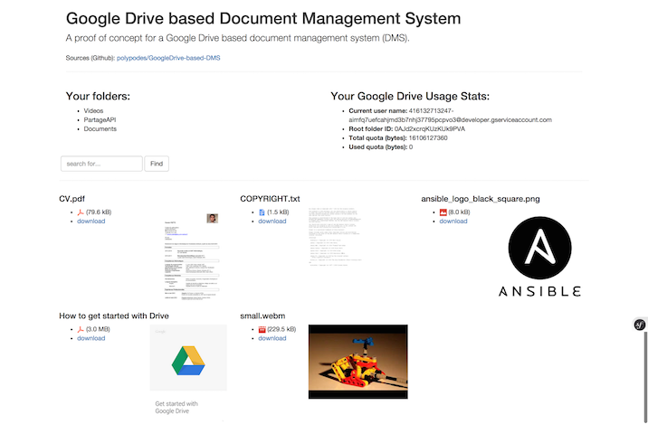

# Google Drive based DMS (atop Symfony2)

A proof of concept for a Google Drive based document management system (DMS)  

Inspired from [genj/GenjGoogleDriveBundle)](https://github.com/genj/GenjGoogleDriveBundle)



## Requirements
  
 * Symfony 2.5, see [composer.json](composer.json)
 * GooglApiClient - https://github.com/google/google-api-php-client, see [composer.json](composer.json)
 * a Google Drive API Project created from [Google Developers Console (GDC)](https://console.developers.google.com/)
 * Google Drive API activated (status: ON) in [GDC](https://console.developers.google.com/) > API & auth > APIs
 * a *Service Account* application type OAuth Client ID in [GDC](https://console.developers.google.com/) > API & auth > Credentials 
 * a new `.p12` ke file, generated & downloaded via the same API Credentials form, to be renamed as `ServiceAccountAPIKey.p12` 
 
## Configuration

You need to get the following information from the [Google API Console](https://code.google.com/apis/console):

* Service account API key file: the `ServiceAccountAPIKey.p12`, generated above, pasted in the `app/config/` folder
* Service account e-mail address: a long `...@developer.gserviceaccount.com` e-mail address, generated above by Google API Console while creating your OAuth Credentials Client ID.

Add these to your parameters.yml:

```
dms.service_account_key_file:
dms.service_account_email:
```

## Usage:

Open a Google Drive session, (right-click) **share a file or an entire folder** 
with the same email address used to fill dms.service_account_email`.

Then open the `/files` route URL in a browser to see, view & download filesize, filetype & thubmnail of each file & folder.

## TODO

See [TODO.md](TODO.md)


## License

MIT
